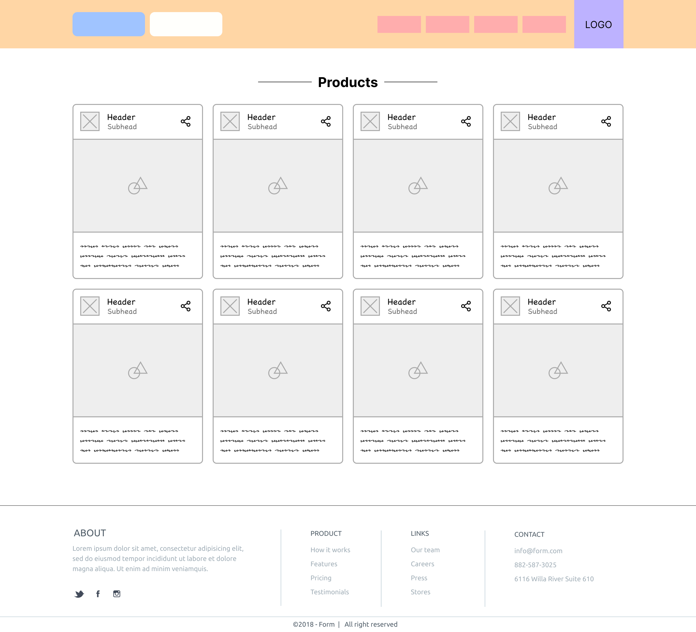
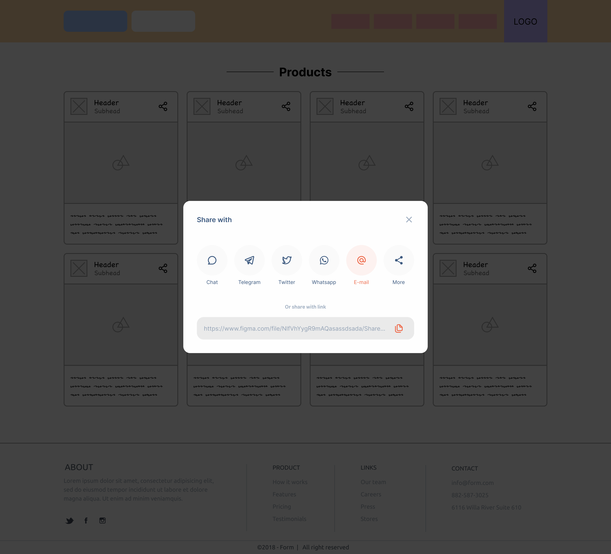
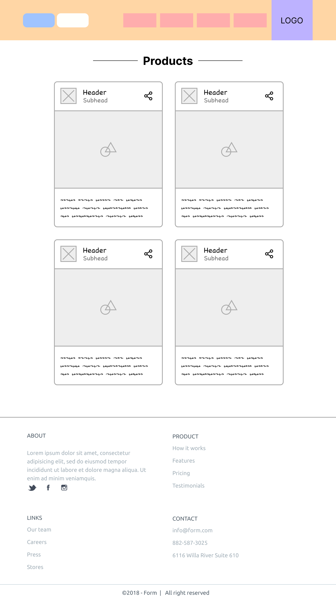
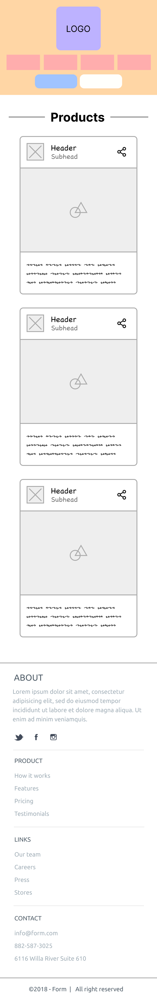

## 🔗 Links

- [Figma UI Link](https://www.figma.com/file/biWLIt5vY865PMYvpsh5Ha/css-challenge-responsive?type=design&mode=design&t=oTnUmREGrSHqjjdI-1)

## ✅ Todos

1. open figma link
2. go to figma.com and register
3. implement frames below :
   - Desktop - 1
   - Desktop - 2
   - Android Large - 1
   - iPad Pro 11" - 1

> everything you needed are located in **_starter directory_**.  
> so you can just download it and make some fun with that 😉  
> good luck 😃

