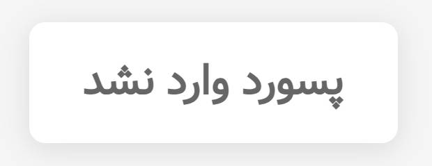
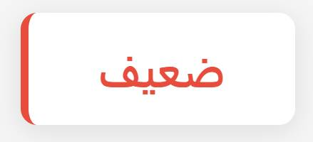

# password strength checker

1. هنگام اجرای صفحه یک مقدار به عنوان پسورد از کاربر دریافت شود
2. میزان امن بودن پسورد مطابق شرایط زیر بررسی شود و خروجی متناظر در صفحه چاپ شود :
   - اگر تعداد کاراکتر های پسورد وارد شده
     - کمتر از 6 کاراکتر : کلمه ضعیف چاپ شود (به رنگ قرمز)
     - بین 6 تا 10 کاراکتر : کلمه متوسط چاپ شود (به رنگ زرد)
     - بیشتر از 10 : کلمه قوی چاپ شود (به رنگ سبز)
   - اگر کاربر مقداری وارد نکرد بنویسد "پسورد وارد نشد"




## راهنمای استایل دهی

برای استایل دهی نتایج، از کلاس‌های از پیش تعریف شده در فایل starter استفاده کنید:

```css
.weak {
  color: #e74c3c;
  border-left: 6px solid #e74c3c;
}

.medium {
  color: #f39c12;
  border-left: 6px solid #f39c12;
}

.strong {
  color: #27ae60;
  border-left: 6px solid #27ae60;
}
```

### نحوه استفاده:

- برای پسورد **ضعیف**: کلاس `weak` را به المان نتیجه اضافه کنید
- برای پسورد **متوسط**: کلاس `medium` را به المان نتیجه اضافه کنید
- برای پسورد **قوی**: کلاس `strong` را به المان نتیجه اضافه کنید
