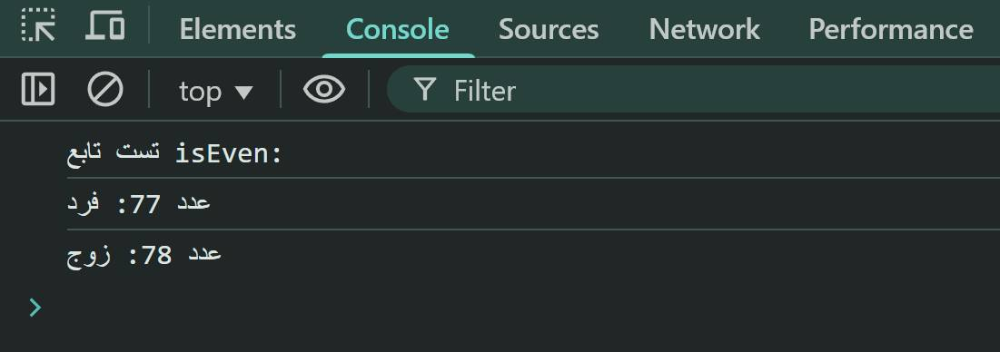

# راهنمای تابع بررسی زوج و فرد بودن اعداد

## مرحله اول

تابعی به نام `isEven` بنویسید که به عنوان ورودی یک عدد بگیرد و به عنوان خروجی رشته "زوج" یا "فرد" را برگرداند.

## مرحله دوم

تابع ایجاد شده را با ورودی‌های زیر تست کنید:

### تست با JavaScript:

```javascript
console.log(isEven(77)); // خروجی: "فرد"
console.log(isEven(78)); // خروجی: "زوج"
```
